# 吞吐量测试案例

| 项目名称                                                     | 版本  | 日期      | 提交哈希                                 |
| ------------------------------------------------------------ | ----- | --------- | ---------------------------------------- |
| [FastMiniRaft](https://github.com/guochaosheng/FastMiniRaft) | 0.1.1 | 9/16/2021 | 62b98cfa945a39009cacd4b7f70936aa7619f80a |

### 测试环境系统架构


### 测试环境软硬件配置

| 硬件名称    | 数量 | 硬件配置                                                     | 软件配置                                                     | 备注 |
| ----------- | ---- | ------------------------------------------------------------ | ------------------------------------------------------------ | ---- |
| Raft 服务器 | 3    | 实例规格：     阿里云 ecs.c6.4xlarge（详见附录） 存储：     40 G 系统盘（高效云盘）+ 1500 G 数据盘（高效云盘），高效云盘的性能详见附录 | CentOS 7.6 64 位 java-1.8.0-openjdk-1.8.0.252.b09-2.el7_8.x86_64 |      |

### 负载机软硬件配置

| 硬件名称 | 数量 | 硬件配置                                                     | 软件配置                                                     | 备注 |
| -------- | ---- | ------------------------------------------------------------ | ------------------------------------------------------------ | ---- |
| 负载机   | 1    | 实例规格：     阿里云 ecs.c6.4xlarge（详见附录） 存储：     40 G 系统盘（高效云盘），高效云盘的性能详见附录 | CentOS 7.6 64 位 java-1.8.0-openjdk-1.8.0.252.b09-2.el7_8.x86_64 |      |

### 操作步骤

| 序号 | 命令或者操作                                                 | 说明 |
| ---- | ------------------------------------------------------------ | ------------------------------------------------------------ |
| 1    | git clone https://github.com/guochaosheng/FastMiniRaft.git   | 下载项目 |
| 2    | cd FastMiniRaft && git checkout aeda939647b267046e7efabb808302621295e0ed | 根据 commit hash 检出目标代码 |
| 3    | mvn clean package dependency:copy-dependencies -Dmaven.test.skip=true | 编译打包 |
| 4    | scp -r fastminiraft-core/target/dependency fastminiraft-core/target/\*.jar fastminiraft-benchmark/target/\*.jar root@172.30.11.4:/opt scp -r fastminiraft-core/target/dependency fastminiraft-core/target/\*.jar fastminiraft-benchmark/target/\*.jar root@172.30.11.5:/opt scp -r fastminiraft-core/target/dependency fastminiraft-core/target/\*.jar fastminiraft-benchmark/target/\*.jar root@172.30.11.6:/opt scp -r fastminiraft-core/target/dependency fastminiraft-core/target/\*.jar fastminiraft-benchmark/target/\*.jar root@172.30.11.7:/opt | 复制所有 jar 包至各个服务器 |
| 5    | cd /opt && \   nohup java -Dflush.max.entries=2000 -Dapp.dir='/data/fastminiraft' \  -Dserver.cluster='n1-172.30.11.4:6001;n2-172.30.11.5:6001;n3-172.30.11.6:6001' -Dserver.id='n1' \  -Xms12G -Xmx12G -XX:+PrintGCDetails -XX:+PrintGCDateStamps -Xloggc:n1.gc.log \  -cp .:./dependency/*:./fastminiraft-core-0.1.1.jar:./fastminiraft-benchmark-0.1.1.jar \  org.nopasserby.fastminiraft.benchmark.ThroughputTestServer > server.1.stdout 2>&1 & | 启动 n1 节点服务                                |
| 6    | cd /opt && \  nohup java -Dflush.max.entries=2000 -Dapp.dir='/data/fastminiraft' \  -Dserver.cluster='n1-172.30.11.4:6001;n2-172.30.11.5:6001;n3-172.30.11.6:6001' -Dserver.id='n2' \  -Xms12G -Xmx12G -XX:+PrintGCDetails -XX:+PrintGCDateStamps -Xloggc:n2.gc.log \  -cp .:./dependency/*:./fastminiraft-core-0.1.1.jar:./fastminiraft-benchmark-0.1.1.jar \  org.nopasserby.fastminiraft.benchmark.ThroughputTestServer > server.2.stdout 2>&1 & | 启动 n2 节点服务                                               |
| 7    | cd /opt && \  nohup java -Dflush.max.entries=2000 -Dapp.dir='/data/fastminiraft' \  -Dserver.cluster='n1-172.30.11.4:6001;n2-172.30.11.5:6001;n3-172.30.11.6:6001' -Dserver.id='n3' \  -Xms12G -Xmx12G -XX:+PrintGCDetails -XX:+PrintGCDateStamps -Xloggc:n3.gc.log \  -cp .:./dependency/*:./fastminiraft-core-0.1.1.jar:./fastminiraft-benchmark-0.1.1.jar \  org.nopasserby.fastminiraft.benchmark.ThroughputTestServer > server.3.stdout 2>&1 | 启动 n3 节点服务 |
| 8    | cd /opt && \  java -Dmessage.size=64 \  -Dserver.cluster='n1-172.30.11.4:6001;n2-172.30.11.5:6001;n3-172.30.11.6:6001' \  -XX:+UseG1GC -XX:+PrintGCDetails -XX:+PrintGCDateStamps -Xloggc:client.1.gc.log -XX:+HeapDumpOnOutOfMemoryError \  -cp .:./dependency/*:./fastminiraft-core-0.1.1.jar:./fastminiraft-benchmark-0.1.1.jar \  org.nopasserby.fastminiraft.benchmark.ThroughputTest > client.1.stdout 2>&1 & | 启动 32 个客户端，启动命令同理 |

### 测试结果

①  n1 节点

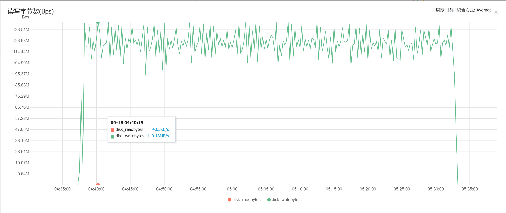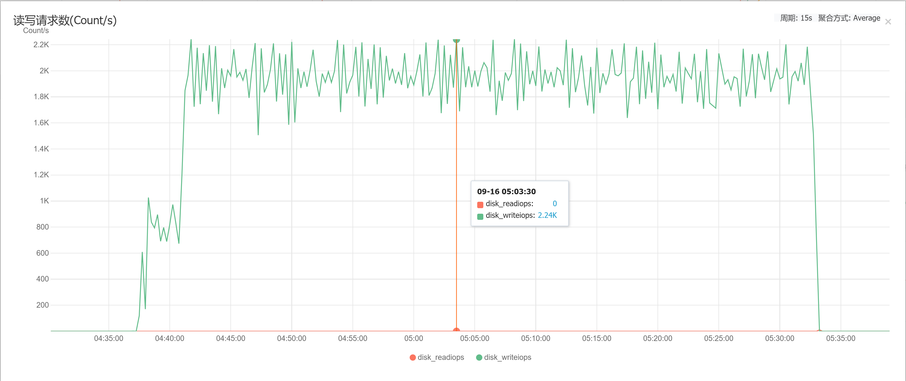

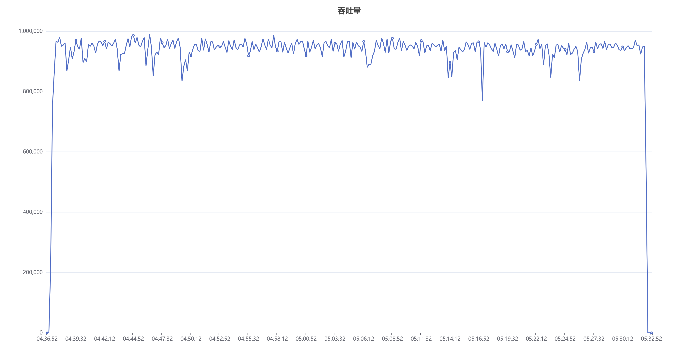

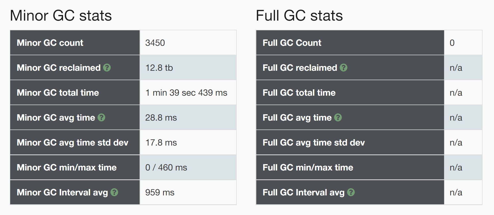

说明：上述监控图表中，CPU使用率、内存使用量、读写字节数(bps)、读写请求数(Count/s) 来自阿里云主机监控，吞吐量来自 server.1.stdout 日志分析，Minor GC stats、Full GC stats 来自 n1.gc.log 日志分析

② n2 节点

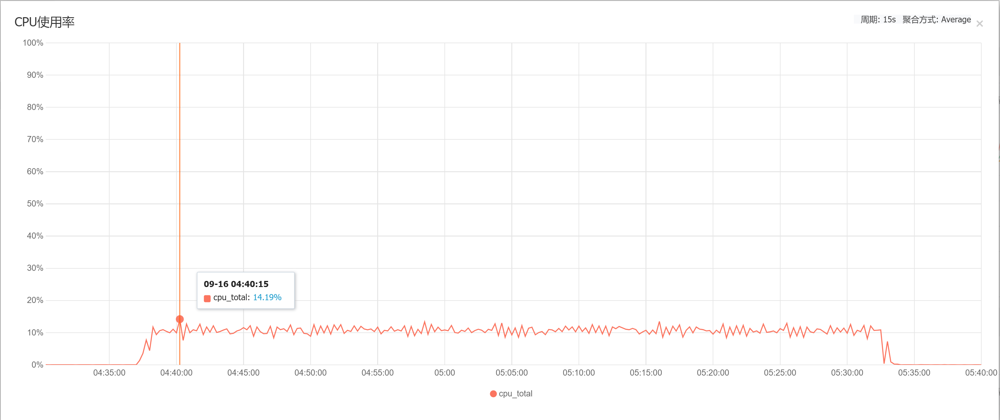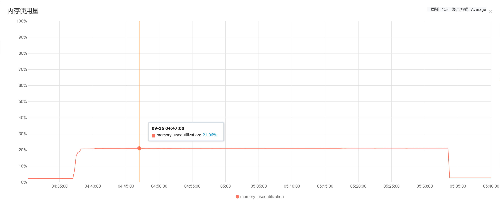

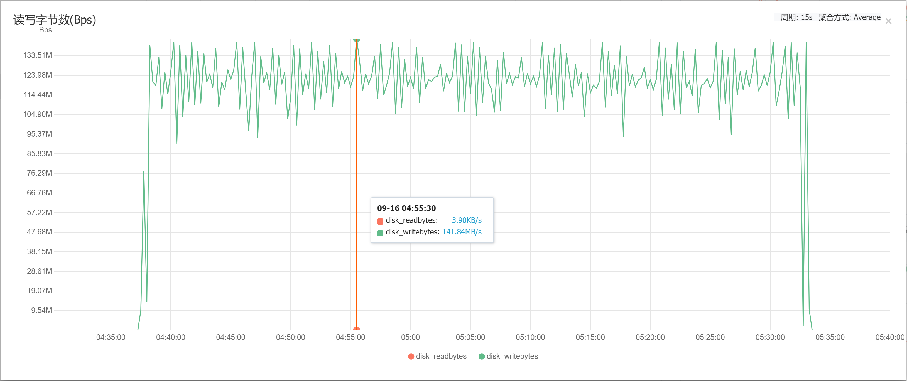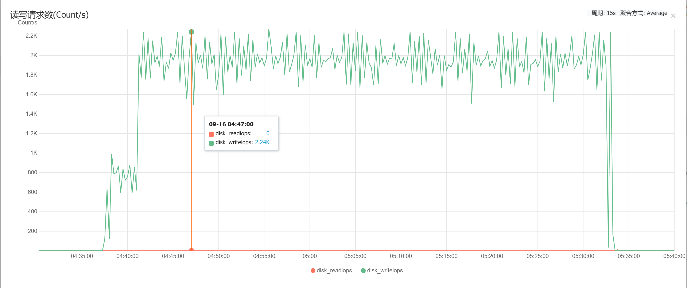

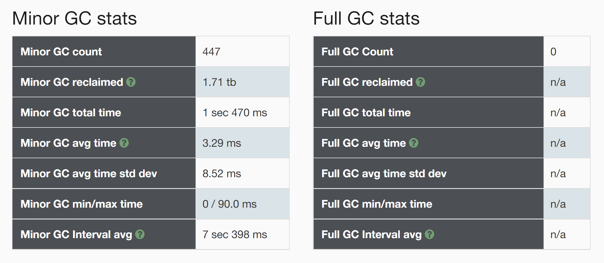

说明：上述监控图表中，CPU使用率、内存使用量、读写字节数(bps)、读写请求数(Count/s) 来自阿里云主机监控，Minor GC stats、Full GC stats 来自 n2.gc.log 日志分析

③ n3 节点

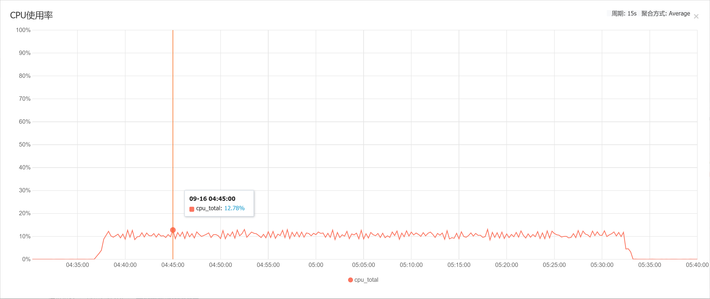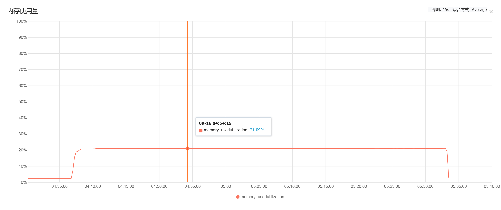

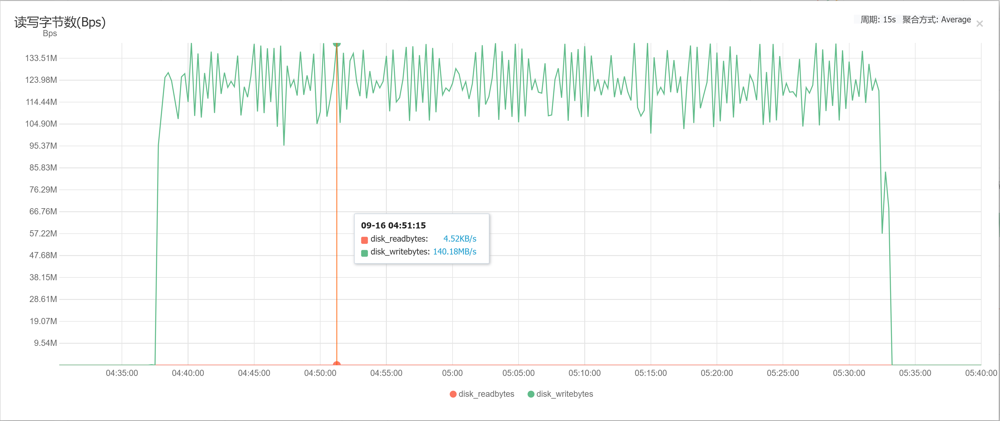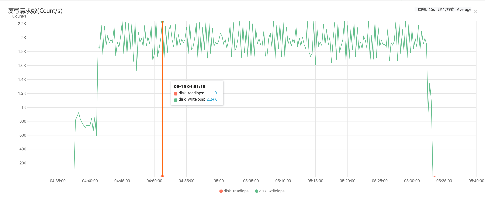

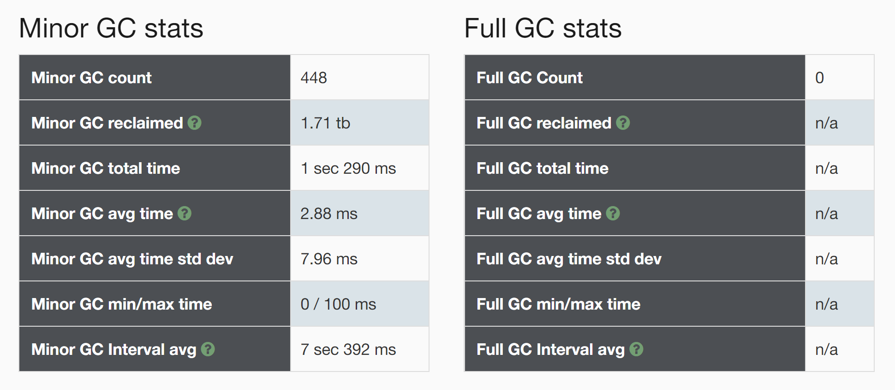

说明：上述监控图表中，CPU使用率、内存使用量、读写字节数(bps)、读写请求数(Count/s) 来自阿里云主机监控，Minor GC stats、Full GC stats 来自 n3.gc.log 日志分析

④ client 节点

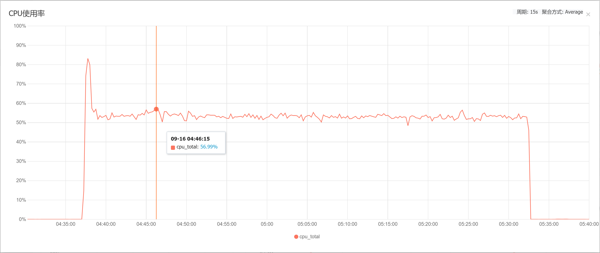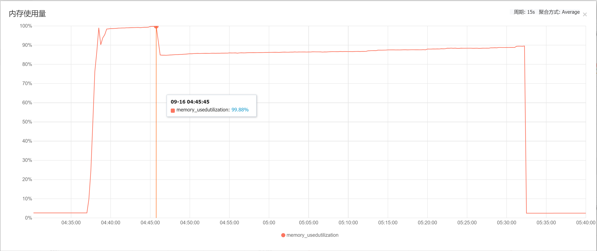

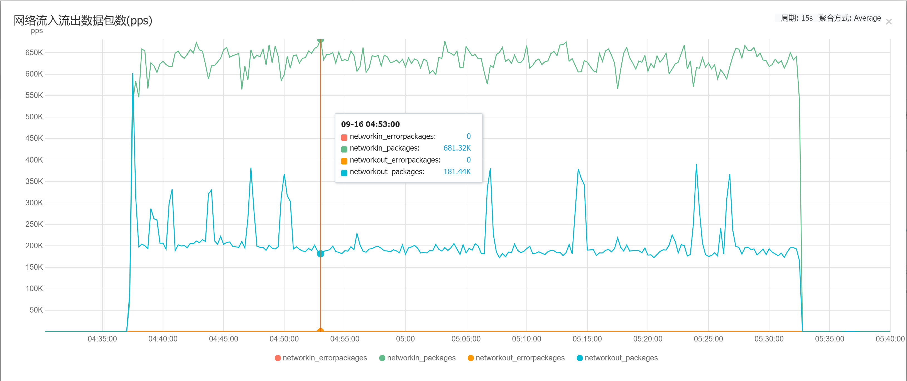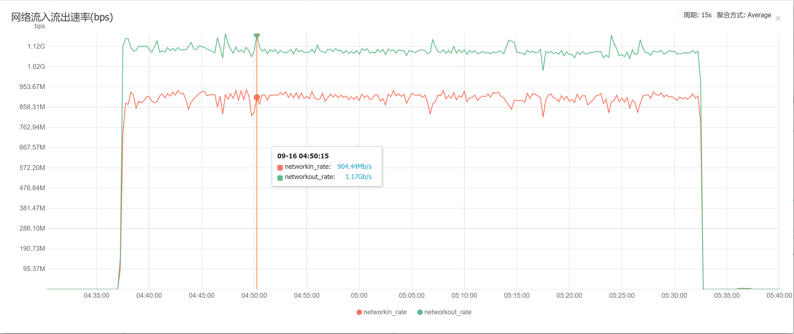

说明：上述监控图表中，CPU使用率、内存使用量、网络流入流出数据包数(pps)、网络流入流出速率(bps) 来自阿里云主机监控

### 附录 A 服务器实例规格

*  阿里云服务器实例规格

| 实例规格       | vCPU | 内存（GiB） | 网络带宽基础/突发（Gbit/s） | 网络收发包PPS | 连接数 | 多队列 | 弹性网卡 | 单网卡私有IP | 云盘IOPS | 云盘带宽（Gbit/s） |
| :------------- | :--- | :---------- | :-------------------------- | :------------ | :----- | :----- | :------- | :----------- | :------- | :----------------- |
| ecs.c6.4xlarge | 16   | 32          | 5/10                        | 100万         | 30万   | 8      | 8        | 20           | 4万      | 3                  |

### 附录 B 云盘的性能

* 阿里云高效云盘的性能

| 性能类别                                | 高效云盘                |
| --------------------------------------- | ----------------------- |
| 单盘容量范围（GiB）                     | 20~32768                |
| 最大IOPS                                | 5000                    |
| 最大吞吐量（MB/s）                      | 140                     |
| 单盘IOPS性能计算公式 ②                  | min{1800+8*容量, 5000}  |
| 单盘吞吐量性能计算公式（MB/s） ②        | min{100+0.15*容量, 140} |
| 数据可靠性                              | 99.9999999%             |
| 单路随机写平均时延（ms），Block Size=4K | 1~3                     |

​	② 单盘性能计算公式说明：
 - 以单块SSD云盘最大IOPS计算公式为例说明：起步1800，每GiB增加30，上限为25000。
 - 以单块SSD云盘最大吞吐量计算公式为例说明：起步120 MB/s，每GiB增加0.5 MB/s，上限为300 MB/s。