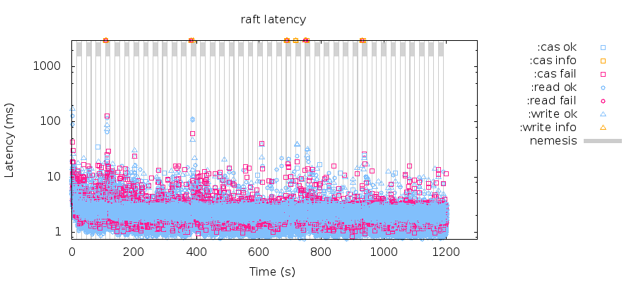
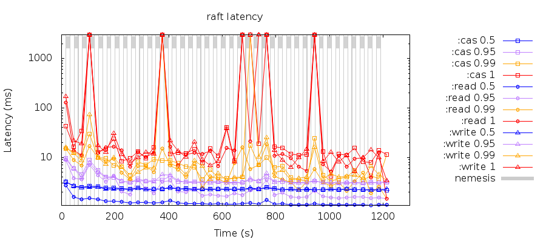
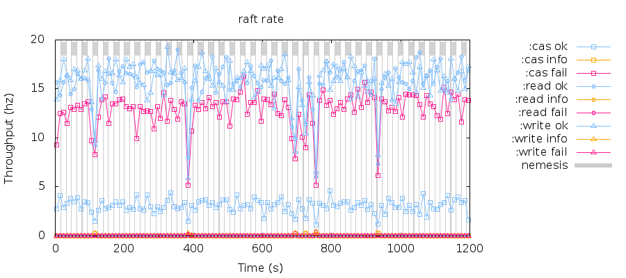

# Reliability Test Case (hammer-time)

5 个 Raft 集群服务器节点，5 个并发客户端

## 结构图

<div align=center></div>

## 测试方案

​    5 个客户端不断并发向 Raft 服务器集群进行写入，读取，比较更新操作，隔 15 秒随机选择 Raft 服务器集群中一个节点 SIGSTOP 其 Raft 服务器进程，此状态维持 15 秒后 SIGCONT 节点进程恢复服务，之后维持 15 秒正常状态再重新选择一个或者多个节点重来，如此重复 40 个周期，最后检查是否通过线性一致性验证。

​    本次测试方案实施采用 Jepsen 测试框架进行线性一致性验证，如果最终显示 Everything looks good! 说明通过线性一致性验证，如果最终显示 Analysis invalid! 说明失败。

### 执行命令清单和操作流程

**快速安装启动 docker、docker-compose**

```
yum install -y yum-utils device-mapper-persistent-data lvm2

yum-config-manager --add-repo https://download.docker.com/linux/centos/docker-ce.repo

yum -y install docker-ce docker-ce-cli containerd.io

curl -L "https://github.com/docker/compose/releases/download/1.28.4/docker-compose-$(uname -s)-$(uname -m)" -o /usr/local/bin/docker-compose

chmod +x /usr/local/bin/docker-compose

ln -s /usr/local/bin/docker-compose /usr/bin/docker-compose

systemctl start docker
```

**下载 FastMiniRaft 最新代码（版本 0.1.1），运行脚本快速部署 jepsen docker 节点**

```
wget -O FastMiniRaft-master.zip https://github.com/guochaosheng/FastMiniRaft/archive/refs/heads/master.zip
yum install -y unzip
unzip FastMiniRaft-master.zip
cd FastMiniRaft-master/fastminiraft-jepsen/docker
sh up.sh --dev
```

**进入 jepsen-control docker 节点命令行界面，构建、部署、运行测试用例**

```
docker exec -it jepsen-control bash
control run jepsen build
control run jepsen deploy
sh run_test.sh --nemesis hammer-time --time-limit 1200
```

### 在阿里云上的测试结果

* 基础信息

1. 服务器参数：

| 规格          | vCPU | 处理器型号                                                   | 内存（GiB） | 本地存储（GiB）     | 网络基础带宽能力（出/入）（Gbit/s） | 网络收发包能力（出+入）（万PPS） | 多队列 | IOPS | 云盘最大吞吐量（MB/s） |
| :------------ | :--- | :----------------------------------------------------------- | :---------- | :------------------ | :---------------------------------- | :------------------------------- | :----- | :--- | :--------------------- |
| ecs.c5.xlarge | 2    | Intel Xeon(Skylake) Platinum 8163 / Intel Xeon(Cascade Lake) Platinum 8269CY | 8           | 系统盘高效云盘 40 G | 1                                   | 30                               | 2      | 1800 | 110                    |

2. 操作系统：CentOS 7.6 64bit

* FastMiniRaft 可靠性测试报告：

1. 客户端操作时延图

<div align=center></div>

2. 客户端操作时延百分位点图

<div align=center></div>

3. 客户端吞吐量图

<div align=center></div>

4. 故障注入日志

   | nemesis info of jepsen.log                                   |
   | ------------------------------------------------------------ |
   | {"n1" [:paused "java"]}<br/>{"n1" [:paused "java"]}<br/>{"n4" [:paused "java"]}<br/>{"n2" [:paused "java"]}<br/>{"n3" [:paused "java"]}<br/>{"n5" [:paused "java"]}<br/>{"n3" [:paused "java"]}<br/>{"n5" [:paused "java"]}<br/>{"n4" [:paused "java"]}<br/>{"n4" [:paused "java"]}<br/>{"n4" [:paused "java"]}<br/>{"n5" [:paused "java"]}<br/>{"n1" [:paused "java"]}<br/>{"n5" [:paused "java"]}<br/>{"n5" [:paused "java"]}<br/>{"n3" [:paused "java"]}<br/>{"n2" [:paused "java"]}<br/>{"n2" [:paused "java"]}<br/>{"n1" [:paused "java"]}<br/>{"n5" [:paused "java"]}<br/>{"n3" [:paused "java"]}<br/>{"n2" [:paused "java"]}<br/>{"n4" [:paused "java"]}<br/>{"n1" [:paused "java"]}<br/>{"n4" [:paused "java"]}<br/>{"n2" [:paused "java"]}<br/>{"n4" [:paused "java"]}<br/>{"n1" [:paused "java"]}<br/>{"n2" [:paused "java"]}<br/>{"n4" [:paused "java"]}<br/>{"n3" [:paused "java"]}<br/>{"n5" [:paused "java"]}<br/>{"n3" [:paused "java"]}<br/>{"n5" [:paused "java"]}<br/>{"n2" [:paused "java"]}<br/>{"n1" [:paused "java"]}<br/>{"n2" [:paused "java"]}<br/>{"n3" [:paused "java"]}<br/>{"n5" [:paused "java"]} |

5. 结果报告

   | 结果报告                                                     |
   | :----------------------------------------------------------- |
   | 正确，最终输出显示 Everything looks good! 说明通过线性一致性验证。 |


